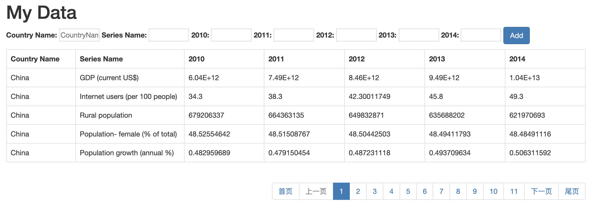
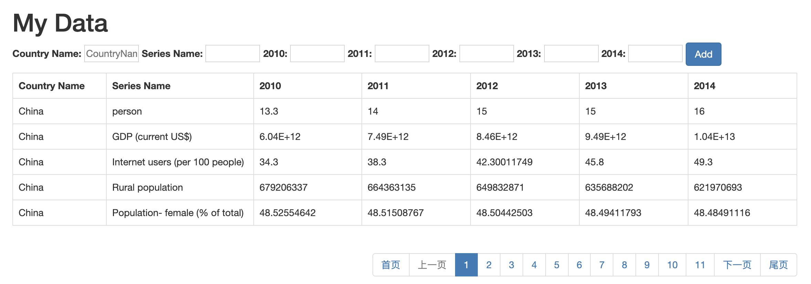

### Usage

1.新建data文件夹，将 countriesData.csv 文件夹放入其中。

2.

```bash
python data.py
```

3.打开网址http://127.0.0.1:5000/

### Requirement

flask

### Content

##### Backend

data.py  — 负责与前端的信息交互

page_utils.py — 负责进行分页操作，将指定条目上的内容输出给前端

##### Frontend

templates/FrontEndData.html— 前端网页，使用bootstrap样式

### Performance

页面样式：



加入新行：



